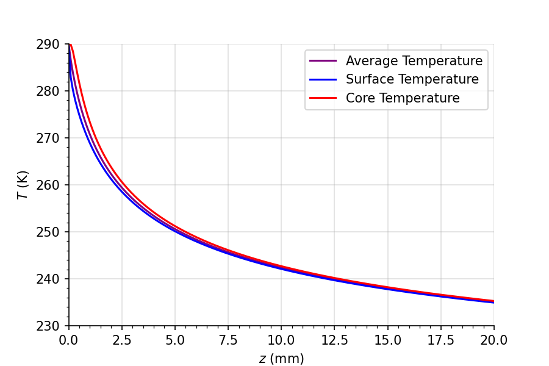

# temp_liq_jet

**temp_liq_jet** is a Python package for computing the temperature of liquid jets
(**water, argon, krypton**) in vacuum using the **Knudsen evaporative cooling model**.

The package solves coupled **mass evaporation and heat transport equations** for concentric shells and
provides interpolated profiles for temperatures, jet radius, and mass loss along the jet.

---

## Features

- Evaporative cooling of liquid jets and droplets
- Supported liquids: **water, argon, krypton**
- Cylindrical (filament) and spherical (droplet) geometries
- Coupled mass and heat transport solved using **SciPy ODE solvers**
- Interpolated profiles for:
  - Shell temperatures
  - Jet / droplet radius
  - Average, surface, and core temperatures
- Multiple density and heat-capacity models for water

---

## Installation

Install the package via terminal:

```bash
python -m pip install temp_liq_jet
```

---

## Quick start

One can for example compute the average, surface, and core temperatures for a water droplet as follows.

```python
import matplotlib.pyplot as plt
from temp_liq_jet import KnudsenModel
import numpy as np


liquid_jet = KnudsenModel(
    liquid="water",             # 'water', 'argon', or 'krypton'
    w_cp_model="Angell1982",    # Water heat capacity model ('Angell1982', 'Archer2000', 'Pathak2021')
    w_rho_model="Hare1987",     # Water density model ('Hare1987', 'Caupin2019')
    D=3,                        # Geometry, with 2 = filament, 3 = droplet
    T_nozzle=290,               # Nozzle temperature (K)
    d=8e-6,                     # Initial jet/droplet diameter (m)
    v=20.0,                     # Jet velocity (m/s)
    N=80,                      # Number of concentric shells
    z_end_mm=20,                # Integration length (mm)
)
```

Retrieve interpolated temperature splines
```python
avg_temp = liquid_jet.avg_temperature()
surface_temp = liquid_jet.surface_temp()
core_temp = liquid_jet.core_temp()
```

Generate distances along the jet
```python
z_points = np.linspace(0, 0.02, 200)  # in meters
```

Plot
```python
fig, ax = plt.subplots(figsize=(6,4))
ax.plot(z_points*1000, avg_temp(z_points), label="Average Temperature", color="purple")
ax.plot(z_points*1000, surface_temp(z_points), label="Surface Temperature", color="blue")
ax.plot(z_points*1000, core_temp(z_points), label="Core Temperature", color="red")

ax.set_xlabel(r"$z$ (mm)")
ax.set_ylabel(r"$T$ (K)")
ax.set_xlim(0, 20)
ax.set_ylim(230, 290)
ax.legend()
ax.grid(True)
ax.minorticks_on()
ax.grid(True, alpha = 0.4)
ax.spines['top'].set_visible(False)
ax.spines['right'].set_visible(False)

plt.show()
```



## Credits

Please cite as:

C. Goy, R. E. Grisenti (2026)  
*KnudsenModel: A Physically Consistent Python Framework for Computing Evaporative Cooling of Liquid Jets*  